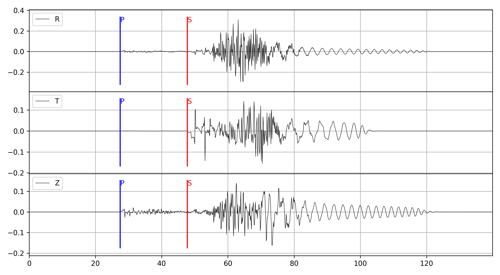

<p align="center">
  
</p>

<p align="center">
  
  
  
  
</p>

<h3 align="center">
  <strong><a href="https://github.com/Dengda98/PyGRT">PyGRT</a>: An integrated, efficient C/Python toolkit for theoretical simulation in layered half-space media</strong>
</h3>

<h4 align="center">
  <a href="https://pygrt.readthedocs.io/zh-cn/"><strong>Chinese Document</strong></a>
  &nbsp;|&nbsp;
  <s>English Document (no longer maintained)</s>
</h4>

<p align="center">
  
</p>

# At a Glance

- **Dynamic and static responses** (displacement, strain, stress, rotation, and related quantities)
- **Surface-wave modal analysis** (dispersion curves, eigenfunctions, and related quantities)
- **Auxiliary modules** (Green's functions, kernels, Lamb problem, Okada solution, and more)
- **CLI and Python API** (modular `grt` command-line tool and Python interface)
- **Actively maintained** — see the [documentation](https://pygrt.readthedocs.io/zh-cn/) for modules and tutorials

# Quick Install

**Pre-built binaries** are available for **Linux**, **macOS**, and **Windows**:

```bash
pip install pygrt-kit
```

Then in Python:

```python
import pygrt
```

PyGRT also provides the **`grt`** CLI. Run `grt -h` to list available modules, and `grt <module> -h` (e.g., `grt greenfn -h`) for module-specific usage.

To use the CLI only (without Python), download the pre-built `*.tar.gz` archive for your platform from [GitHub Releases](https://github.com/Dengda98/PyGRT/releases).

*(For conda environments, source builds, and troubleshooting, see the [installation guide](https://pygrt.readthedocs.io/zh-cn/install.html) (Chinese)).*

# Contact
If you have any questions or suggestions, feel free to reach out:
- **Email**: zhudengda@mail.iggcas.ac.cn
- **GitHub Issues**: You can also raise an issue directly on GitHub.

# Citation

Since PyGRT has been under continuous maintenance and extension during the peer review, **its functions have exceeded the scope described in this paper.** For detailed usage of each function, please see the [**documentation**](https://pygrt.readthedocs.io/zh-cn/).

> Zhu, D., Wang, J., Hao, J., Yao, S., Xu, Y., Xu, T., and Yao, Z. (2025). PyGRT: An Efficient and Integrated Python Package for Computing Synthetic Seismograms in a Layered Half‐Space Model. Seismological Research Letters, 97(3), 2138–2153. doi: [10.1785/0220250057](https://doi.org/10.1785/0220250057)

> Zhu, D., Xu, T., Hao, J., and Yao, Z. (2025). A Direct Convergence Method for Computing Synthetic Seismograms for a Layered Half‐Space with Sources and Receivers at Close Depths. Bulletin of the Seismological Society of America, 116(2), 576–588. doi: [10.1785/0120250190](https://doi.org/10.1785/0120250190)

> Zhu, D., Xu, T., Hao, J., and Yao, Z. (2026). An Adaptive Strategy for Robust and Efficient Computation of Dispersion Curves in a Layered Half-Space, Bulletin of the Seismological Society of America. doi: [doi.org/10.1785/0120260071](https://doi.org/10.1785/0120260071)

---------------
⭐ **Like this project? Give it a Star!** ⭐


<a href="https://www.star-history.com/?repos=Dengda98%2FPyGRT&type=date&legend=top-left">
 <picture>
   <source media="(prefers-color-scheme: dark)" srcset="https://api.star-history.com/chart?repos=Dengda98/PyGRT&type=date&theme=dark&legend=top-left&sealed_token=Wh3FLANubp3kqhtwCRymlY-guZ4mrInTSHzj11UQIWRcZRbFR6g9ltLppgkEe7XMGqSA-cur0s3sR6w07X1DGsk4ItUUz-YSK9WC0nD2ya9XGi5AbHQm_w" />
   <source media="(prefers-color-scheme: light)" srcset="https://api.star-history.com/chart?repos=Dengda98/PyGRT&type=date&legend=top-left&sealed_token=Wh3FLANubp3kqhtwCRymlY-guZ4mrInTSHzj11UQIWRcZRbFR6g9ltLppgkEe7XMGqSA-cur0s3sR6w07X1DGsk4ItUUz-YSK9WC0nD2ya9XGi5AbHQm_w" />
   
 </picture>
</a>
