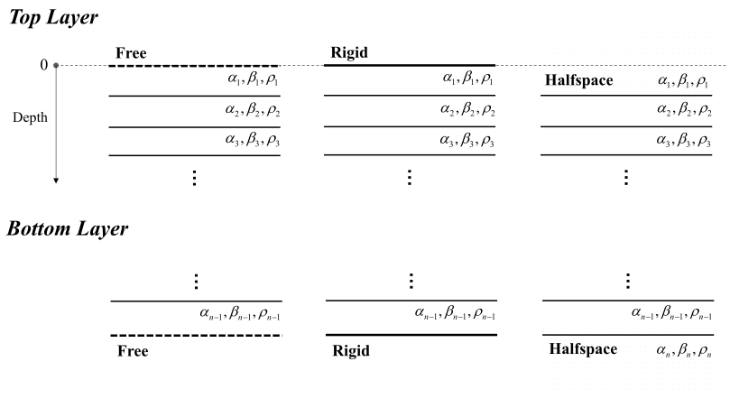

:author: 朱邓达
:date: 2025-01-08

顶底界面的边界条件
=====================

默认情况下，一维层状模型的顶界面为 **自由边界** ，即过 z 平面的牵引力为 0；
底界面为 **半无限空间** ，其对应模型文件的最后一行。

自版本 0.15.0 起， **PyGRT** 支持设置顶底界面的边界条件，可设置为 **自由边界，刚性边界和半无限空间** ， 公式推导详见 :doc:`/Formula/boundary` ，示例详见 :doc:`/Gallery/ex16/ex16` 。
为了不改变默认的模型输入，顶、底界面对边界条件的处理会有些区别，详见以下示意图。

通过以下可选参数，可设置顶底界面的边界条件。

.. tabs::

    .. group-tab:: C 

        详见 :doc:`/Module/greenfn` 和 :doc:`/Module/static_greenfn` 模块的 **-B** 选项。
         
    .. group-tab:: Python

        :func:`PyModel1D() <pygrt.pymod.PyModel1D>` 创建模型时可设置边界条件：

        + ``topbound:Literal['free', 'rigid', 'halfspace']`` 顶层边界条件
        + ``botbound:Literal['free', 'rigid', 'halfspace']`` 底层边界条件
