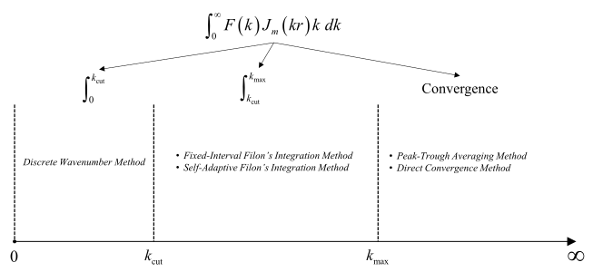

:author: 朱邓达
:date: 2025-12-15

波数积分上限和间隔
========================

    波数积分过程中各阶段使用的方法

动态全波解和静态位移场的计算需进行波数积分，以下介绍相关参数和用法。

.. toctree::
    :maxdepth: 1

    kmax
    linear_filon
    safim/self_adaptive_filon
    drift/waveform_drift