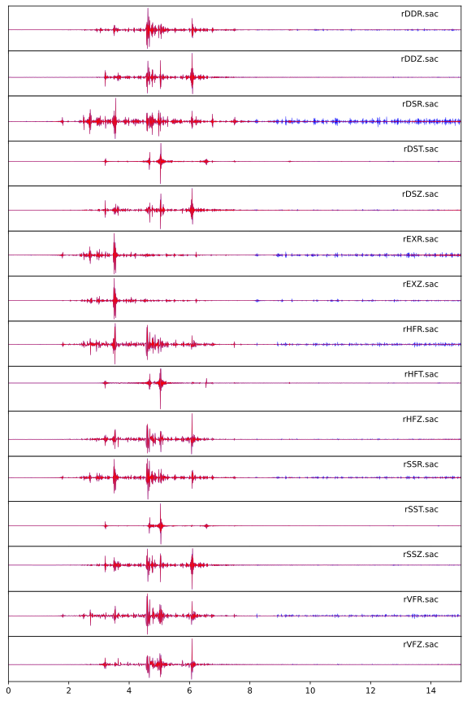

:author: 朱邓达
:date: 2025-12-19

差分验证动态位移空间偏导数
---------------------------------------

下载示例： :download:`ex02.tar.gz`

在 :doc:`/Tutorial/dynamic/strain_stress` 部分介绍的物理量需要计算位移对空间的偏导。
位移对 :math:`z, r` 的偏导可在计算格林函数阶段完成，
其中对 :math:`z` 的偏导涉及计算核函数对 :math:`z` 的偏导，相应公式已在 :doc:`/Formula/uiz` 给出。
位移对 :math:`\theta` 的偏导已经转移到合成阶段。

以下示例使用前向差分来验证位移对 :math:`z, r` 的偏导的理论计算结果，即

.. math::

   \def \p{\partial}
   \def \u{\mathbf{u}}

   \dfrac{\p \u}{\p z} & \approx \dfrac{\u (z+\Delta z) - \u (z)}{\Delta z} \\
   \dfrac{\p \u}{\p r} & \approx \dfrac{\u (r+\Delta r) - \u (r)}{\Delta r}

以下绘制的结果中设置 :math:`\Delta z = \Delta r = 10^{-3}\ \text{km}` 。
蓝线为差分结果，红线为理论计算结果。

+ 位移对 :math:`z` 的偏导

.. figure:: compare_z.svg
   :align: center

+ 位移对 :math:`r` 的偏导

