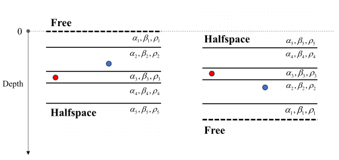

:author: 朱邓达
:date: 2025-01-08

(16) 不同边界条件的测试
-------------------------------------

下载示例： :download:`ex16.tar.gz`

在 :doc:`/Advanced/boundary/boundary` 部分和 :doc:`/Formula/boundary` 部分对边界条件和公式进行了介绍，
尽管顶、底界面对边界条件的处理有些区别，但经过适当配置源点场点深度以及模型参数，可形成两个 **上下翻转** 的系统，
从而进行对比验证。

    红点为源点，蓝点为场点

如上图所示，两个系统呈现上下翻转的关系，这样二者计算的结果之间最多只有正负号的符号差异，
这为顶底界面的边界条件提供了一个互相验证的测试。
以下进行一些对比测试，可见对分量符号进行校正后，结果完美吻合。

示例一
~~~~~~~~~~~~~~~

.. figure:: free_halfspace.svg
    :align: center

    动态解已卷积阶跃函数，下同

示例二
~~~~~~~~~~~~~~~

.. figure:: rigid_halfspace.svg
    :align: center

示例三
~~~~~~~~~~~~~~~

以上实例都是在层状介质中进行。若仅设置单层介质并把顶底界面都设置为半空间，
则相当于求解 **无限均匀空间中的格林函数** ，这可用解析解验证。

.. figure:: halfspace_halfspace.svg
    :align: center

以下为解析解，其中动态解公式参考《Quantitative Seismology》，
静态解公式参考 :doc:`/Formula/static_uniform` 。与上图比较可见结果吻合。

.. figure:: theoretical.svg
    :align: center