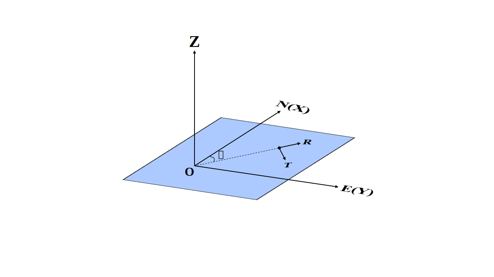

.. _gfunc_rst:

计算动态格林函数
=================

:Author: Zhu Dengda
:Email:  zhudengda@mail.iggcas.ac.cn

-----------------------------------------------------------

Python中计算动态格林函数的主函数为 :func:`compute_grn() <pygrt.pymod.PyModel1D.compute_grn>` ，C程序为 :command:`grt`。

核心计算逻辑来自  :ref:`初稿 <yao_init_manuscripts>` ，具体代码可见与C API中对应同名 :file:`*.c` 文件，其中计算格林函数频谱的主函数为 :file:`grt.c` 里的 :c:func:`integ_grn_spec`。输出结果的坐标系见下图。

.. _warning_C_python_Z_direction:
.. warning::
   
   **推导过程中定义的Z分量与C/Python输出的Z分量方向相反**。因为从Z轴向下为正的坐标系对于 **半无限水平分层均匀介质** 来讲更便于公式推导；而在结果输出后，会对Z分量取相反数，因为Z轴向上和目前实采数据使用的Z轴方向一致，这更便于后续数据处理。  

   除非特别指明（例如描述震源机制），且一般使用 **PyGRT** 时也不会涉及底层程序内部， **在实际使用过程中提及的Z轴均以向上为正** ，仅在讨论代码内部细节和公式推导时对此加以区分。

示例程序
-----------

假设在 :file:`milrow` 模型中，震源深度2km，接收点位于地表，震中距为5km，8km和10km，计算格林函数，要求采样点数500个点，采样间隔0.02s。

.. tabs::  

    .. group-tab:: C 

        .. literalinclude:: run/run.sh
            :language: bash
            :start-after: BEGIN GRN
            :end-before: END GRN

        不同震源深度、接收点深度和震中距的格林函数会在 :rst:dir:`GRN/milrow_{depsrc}_{deprcv}_{dist}/` 路径下，使用SAC格式保存。 

        一些基本信息（包括源点和场点的物性参数）保存在SAC头段变量中，其中 :c:var:`t0` 和 :c:var:`t1` 分别代表初至P波和初至S波的到时，由于程序中使用0作为参考时间，故其等价于走时。

        + :command:`grt.travt` 命令可以显式地再计算初至波走时，

         .. literalinclude:: run/run.sh
            :language: bash
            :start-after: BEGIN grt.travt
            :end-before: END grt.travt

         走时结果会输出到终端，

         .. literalinclude:: run/travt
            :language: text 

        + 如果你没有安装SAC软件，可以使用Python的ObsPy库读取生成的SAC数据，或者使用 :command:`grt.b2a` 工具临时将SAC格式文件转为如下的文本文件：

         .. literalinclude:: run/run.sh
            :language: bash
            :start-after: BEGIN grt.b2a
            :end-before: END grt.b2a

         输出的文本文件如下，两列分别为时间点和幅值。这种输出仅保留波形信息，缺失SAC文件中的头段变量。

         .. literalinclude:: run/HFZ_head
            :language: text

    .. group-tab:: Python

        .. literalinclude:: run/run.py
            :language: python
            :start-after: BEGIN GRN
            :end-before: END GRN

        多个震中距的格林函数以列表形式返回，其中每个元素为 |Stream| 类。:class:`Trace.stats.sac` 中保存了SAC头段变量，与C程序输出保持一致。

.. note:: 
   
   格林函数计算结果的单位：  

   + 爆炸源：  :math:`10^{-20} \, \frac{\text{cm}}{\text{dyne} \cdot \text{cm}}`  
   + 单力源：  :math:`10^{-15} \, \frac{\text{cm}}{\text{dyne}}`
   + 剪切源：  :math:`10^{-20} \, \frac{\text{cm}}{\text{dyne} \cdot \text{cm}}`
   + 矩张量源： :math:`10^{-20} \, \frac{\text{cm}}{\text{dyne} \cdot \text{cm}}`

离散波数积分
--------------

格林函数频谱的计算本质转化为求以下积分: 

.. math:: 

   P_m(\omega) = \int_0^\infty F(k, \omega)J_m(kr)kdk 

其中 :math:`F(k,\omega)` 称为核函数，它是和介质属性相关的量，与震中距无关。我们可以使用离散波数积分法 :ref:`(Bouchon, 1981) <bouchon_1981>` 将上式积分转变为求和:

.. math:: 

   P_m(\omega) = \Delta k \sum_{j=0}^{\infty} F(k_j,\omega)J_m(k_j r)k_j

其中 :math:`\Delta k = 2\pi/L, k_j=j\Delta k`，:math:`L` 为特征长度，要求满足:

.. math:: 

   \left\{
   \begin{aligned}
   & r < L/2   \\
   & (L-r)^2 + z_s^2 > (\alpha T)^2  
   \end{aligned}
   \right.

其中 :math:`\alpha` 为参考P波速度， :math:`T` 为所需计算的理论地震图的总时间长度。常见的保守经验值为 :math:`L=20r` ，但也应依具体情况而定 。为了避开附加源以及奇点的影响，:ref:`(Bouchon, 1981) <bouchon_1981>`  在频率上添加微小虚部，具体推导过程详见 :ref:`(Bouchon, 1981) <bouchon_1981>` 和 :ref:`(张海明, 2021) <zhang_book_2021>`。

积分形式分类
--------------

通过在面谐矢量坐标系中建立波函数进行公式推导，最终格林函数的三分量频谱 :math:`W_m(\omega), Q_m(\omega), V_m(\omega)` (分别为垂向，径向，切向)可以表达为:

.. math:: 

   \left\{
   \begin{aligned}
   W_m(\omega) &= \int_0^\infty w_m J_m(kr)kdk  \\
   Q_m(\omega) &= \int_0^\infty (q_m J_m^{\prime}(kr) - v_m \frac{m}{kr} J_m(kr)) kdk  \\
   V_m(\omega) &= \int_0^\infty (q_m \frac{m}{kr} J_m(kr) - v_m  J_m^{\prime}(kr)) kdk 
   \end{aligned}
   \right.

.. note:: 

    初次推导该公式可能会对虚数 :math:`i` 及公式中的正负号感到疑惑，但其实这里的设计是将虚数 :math:`i` 和方向因子 :math:`e^{im\theta}` 合并，所以在后续合成理论地震图时你会发现，:math:`m=0,1,2` 阶的 :math:`W_m, Q_m` 的方向因子对 :math:`(m\theta)` 的偏导就是 :math:`V_m` 的方向因子。

公式来自 :ref:`初稿 <yao_init_manuscripts>` (5.6.22)式，其中阶数 :math:`m=0,1,2`。核函数 :math:`q_m,w_m,v_m` 根据广义反射透射系数矩阵法求得。为了方便程序实现，根据积分形式，我们对待求积分进行如下分类，其中每一阶都分为4类( :math:`p=0,1,2,3` )，除了0阶只需两类，此时 :math:`v_0=0` :

+ :math:`m=0`  [#]_

.. math:: 

   \left\{
   \begin{aligned}
   p=0 & \rightarrow - \int q_0(k, \omega) J_1(kr)kdk \\
   p=2 & \rightarrow   \int w_0(k, \omega) J_0(kr)kdk
   \end{aligned}
   \right.

+ :math:`m=1,2` 

.. math:: 

   \left\{
   \begin{aligned}
   p=0 & \rightarrow   \int q_m(k, \omega) J_{m-1}(kr)kdk \\
   p=1 & \rightarrow - \int (q_m(k, \omega) + v_m(k, \omega)) \frac{m}{kr} J_m(kr)kdk \\
   p=2 & \rightarrow   \int w_m(k, \omega) J_m(kr)kdk \\
   p=3 & \rightarrow - \int v_m(k, \omega) J_{m-1}(kr)kdk
   \end{aligned}
   \right.

以上每个积分都形成 :math:`\int_0^\infty F(k, \omega)J_m(kr)kdk` 的形式，便可逐个使用离散波数积分（或Filon积分、峰谷平均法等）求解每个积分。

.. [#] 感谢席超强博士 `@xichaoqiang <https://github.com/xichaoqiang>`_ 的订正。

.. _grn_types:

格林函数分类
--------------

程序会输出15个格林函数（也可以选择输出哪些震源），但并不是每个震源类型对应的每一阶每种积分类型都存在。以下为15个格林函数定义的名称，以及对应上述的阶数以及积分类型:

+----------+-------------------+--------------+----------------------+
| **名称** | **格林函数类型**  | **对应阶数** | **对应积分类型**     |
+----------+-------------------+--------------+----------------------+
| EXZ      | 爆炸源Z分量       | :math:`m=0`  | :math:`p=2`          |
+----------+-------------------+--------------+----------------------+
| EXR      | 爆炸源R分量       | :math:`m=0`  | :math:`p=0`          |
+----------+-------------------+--------------+----------------------+
| VFZ      | 垂直向下力源Z分量 | :math:`m=0`  | :math:`p=2`          |
+----------+-------------------+--------------+----------------------+
| VFR      | 垂直向下力源R分量 | :math:`m=0`  | :math:`p=0`          |
+----------+-------------------+--------------+----------------------+
| HFZ      | 水平力源Z分量     | :math:`m=1`  | :math:`p=2`          |
+----------+-------------------+--------------+----------------------+
| HFR      | 水平力源R分量     | :math:`m=1`  | :math:`(p=0)+(p=1)`  |
+----------+-------------------+--------------+----------------------+
| HFT      | 水平力源T分量     | :math:`m=1`  | :math:`-(p=1)+(p=3)` |
+----------+-------------------+--------------+----------------------+
| DDZ      | 倾角45度倾滑Z分量 | :math:`m=0`  | :math:`p=2`          |
+----------+-------------------+--------------+----------------------+
| DDR      | 倾角45度倾滑R分量 | :math:`m=0`  | :math:`p=0`          |
+----------+-------------------+--------------+----------------------+
| DSZ      | 倾角90度倾滑Z分量 | :math:`m=1`  | :math:`p=2`          |
+----------+-------------------+--------------+----------------------+
| DSR      | 倾角90度倾滑R分量 | :math:`m=1`  | :math:`(p=0)+(p=1)`  |
+----------+-------------------+--------------+----------------------+
| DST      | 倾角90度倾滑T分量 | :math:`m=1`  | :math:`-(p=1)+(p=3)` |
+----------+-------------------+--------------+----------------------+
| SSZ      | 倾角90度走滑Z分量 | :math:`m=2`  | :math:`p=2`          |
+----------+-------------------+--------------+----------------------+
| SSR      | 倾角90度走滑R分量 | :math:`m=2`  | :math:`(p=0)+(p=1)`  |
+----------+-------------------+--------------+----------------------+
| SST      | 倾角90度走滑T分量 | :math:`m=2`  | :math:`-(p=1)+(p=3)` |
+----------+-------------------+--------------+----------------------+

