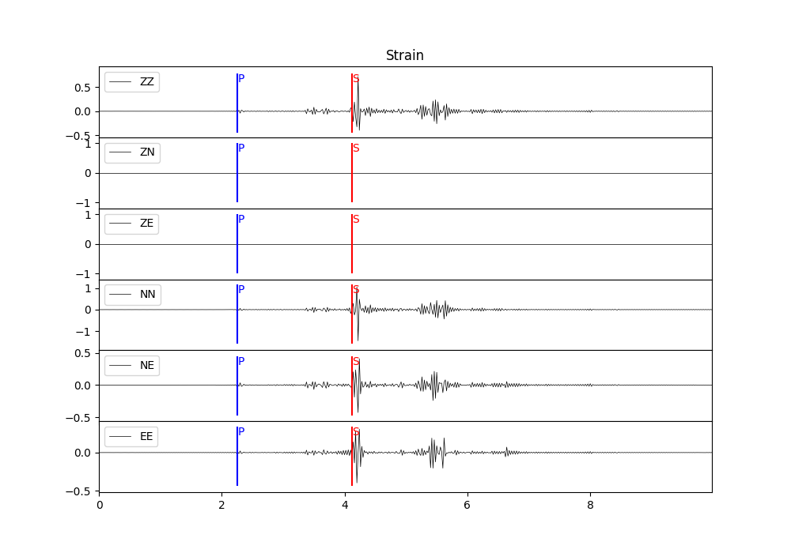
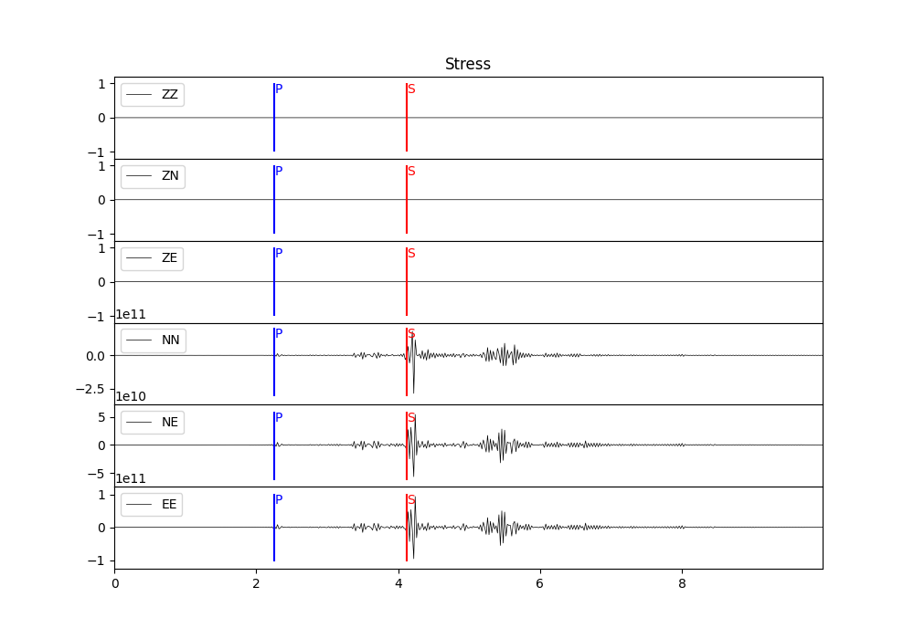

.. _strain_stress_rst:

计算动态应变和应力
===================

:Author: Zhu Dengda
:Email:  zhudengda@mail.iggcas.ac.cn

-----------------------------------------------------------

计算应变张量与应力张量需要计算位移的空间导数 :math:`\partial z,\partial r,\partial \theta` [#]_ 。 从前文关于格林函数的计算 （ :ref:`gfunc_rst` ） 和位移合成的公式 （ :ref:`syn_rst` ） 出发，位移空间导数分两个步骤计算，再根据几何方程和本构方程合成应变和应力。

.. [#] :math:`\partial z,\partial r,\partial \theta` 为 :math:`\dfrac{\partial}{\partial z},\dfrac{\partial}{\partial r},\dfrac{\partial}{\partial \theta}` 的简写。

计算格林函数阶段，求出 :math:`\partial z,\partial r`
-----------------------------------------------------------------------------------------------

假设在 :file:`milrow` 模型中，震源深度2km，接收点位于地表，震中距为10km，计算格林函数及其空间导数，要求采样点数500个点，采样间隔0.02s。

.. tabs:: 

    .. tab:: C 

        .. literalinclude:: run_upar/run.sh
            :language: bash
            :start-after: BEGIN GRN
            :end-before: END GRN

        在 :rst:dir:`GRN/milrow_{depsrc}_{deprcv}_{dist}/` 路径下，文件名开头有"r"和"z"就代表 :math:`\partial r` 和 :math:`\partial z`。

    .. tab:: Python

        .. literalinclude:: run_upar/run.py
            :language: python
            :start-after: BEGIN GRN
            :end-before: END GRN

        通道名开头有"r"和"z"就代表 :math:`\partial r` 和 :math:`\partial z`。

.. note:: 

    计算格林函数阶段求出的空间导数的单位：

    + 爆炸源：  :math:`10^{-25} \, /\text{dyne} \cdot \text{cm}`  
    + 单力源：  :math:`10^{-20} \, /\text{dyne}`
    + 剪切源：  :math:`10^{-25} \, /\text{dyne} \cdot \text{cm}`  
    + 矩张量源： :math:`10^{-25} \, /\text{dyne} \cdot \text{cm}`  

合成位移阶段，求出 :math:`\partial \theta / r` 并合成位移空间导数
-----------------------------------------------------------------------------

假设震源为剪切源，断层走向33°，倾角50°，滑动角120°，标量矩 1e24 dyne·cm，方位角30°。待求项中有 :math:`r` 是为了保证量纲统一。

.. tabs:: 

    .. tab:: C 

        .. literalinclude:: run_upar/run.sh
            :language: bash
            :start-after: BEGIN SYN DC
            :end-before: END SYN DC

        在 :rst:dir:`syn_dc/` 路径下，文件名开头有"r"，"z"，"t"分别代表 :math:`\partial r`， :math:`\partial z`，:math:`\partial \theta / r`。

    .. tab:: Python

        .. literalinclude:: run_upar/run.py
            :language: python
            :start-after: BEGIN SYN DC
            :end-before: END SYN DC

        通道名开头有"r"，"z"，"t"分别代表 :math:`\partial r`， :math:`\partial z`，:math:`\partial \theta / r`。

以上计算的空间导数在柱坐标系下，即 :math:`\dfrac{\partial u(z,r,\theta)}{\partial(z,r,\theta)}`。如果需要 :math:`\dfrac{\partial u(z,x,y)}{\partial(z,x,y)}` （ :math:`x` 表示北向， :math:`y` 表示东向），传入适当参数即可，则输出结果开头的标识符从"z/r/t"变为"z/x/y"。

.. tabs:: 

    .. tab:: C 

        .. literalinclude:: run_upar/run.sh
            :language: bash
            :start-after: BEGIN ZNE
            :end-before: END ZNE

        在 :rst:dir:`syn_dc_zne/` 路径下，文件名开头有"z"，"n"，"e"分别代表 :math:`\partial z`， :math:`\partial x`，:math:`\partial y`。

    .. tab:: Python

        .. literalinclude:: run_upar/run.py
            :language: python
            :start-after: BEGIN ZNE
            :end-before: END ZNE

        通道名开头有"z"，"n"，"e"分别代表 :math:`\partial z`， :math:`\partial x`，:math:`\partial y`。

        .. warning::

            不可以使用ObsPy库中提供的Stream.rotate()函数进行位移空间导数的旋转。

.. note:: 

    合成的位移空间导数单位为1。

合成应变和应力
-----------------------
应变和应力均为二阶对称张量，故将输出6个独立分量。程序选择应变应力的坐标系的依据是——根据文件名/通道名判断是否存在 :math:`\dfrac{\partial u_x}{\partial x}`，如果有则使用ZNE坐标系，否则使用ZRT坐标系。 **所以建议保存结果的文件夹中只使用同种坐标系**，就像上面分为 :rst:dir:`syn_dc/` 和 :rst:dir:`syn_dc_zne/` 两个文件夹保存。

应变张量
~~~~~~~~~~~~~~
根据几何方程 [#]_ 

.. math:: 

    e_{ji} = \dfrac{1}{2} \left( u_{i,j} + u_{j,i} \right) = \dfrac{1}{2} \left( \dfrac{\partial u_i}{\partial x_j} + \dfrac{\partial u_j}{\partial x_i}  \right)

.. [#] 这只适用于ZNE坐标系，对于ZRT坐标系需考虑协变导数。程序中已考虑，这里不再做公式介绍。

.. tabs:: 

    .. tab:: C 

        .. literalinclude:: run_upar/run.sh
            :language: bash
            :start-after: BEGIN STRAIN
            :end-before: END STRAIN

        在 :rst:dir:`syn_dc_zne/` 原路径下，生成 :file:`*.strain.??.sac`，文件名中包括分量名，如ZZ、ZN等。

    .. tab:: Python

        .. literalinclude:: run_upar/run.py
            :language: python
            :start-after: BEGIN STRAIN
            :end-before: END STRAIN

        返回的 |Stream| 通道名即为分量名，如ZZ、ZN等。

应力张量
~~~~~~~~~~~~~~
根据各向同性介质的本构方程 [#]_ 

.. math:: 

    \sigma_{ji} = \lambda \delta_{ij} e_{kk} + 2 \mu e_{ij} = \lambda \delta_{ij} u_{kk} + \mu \left( u_{i,j} + u_{j,i} \right)

.. [#] 这只适用于ZNE坐标系，对于ZRT坐标系需考虑协变导数。程序中已考虑，这里不再做公式介绍。

.. tabs:: 

    .. tab:: C 

        .. literalinclude:: run_upar/run.sh
            :language: bash
            :start-after: BEGIN STRESS
            :end-before: END STRESS

        在 :rst:dir:`syn_dc_zne/` 原路径下，生成 :file:`*.stress.??.sac`，文件名中包括分量名，如ZZ、ZN等。

    .. tab:: Python

        .. literalinclude:: run_upar/run.py
            :language: python
            :start-after: BEGIN STRESS
            :end-before: END STRESS

        返回的 |Stream| 通道名即为分量名，如ZZ、ZN等。

.. note:: 

    计算得到的应力的单位为 :math:`\frac{\text{dyne}}{\text{cm}^2} = 0.1 \text{Pa}`。

由于场点位于地表（自由表面），过Z平面的应力均为0（由于浮点数计算误差，呈极小非零数），结果和理论保持一致。