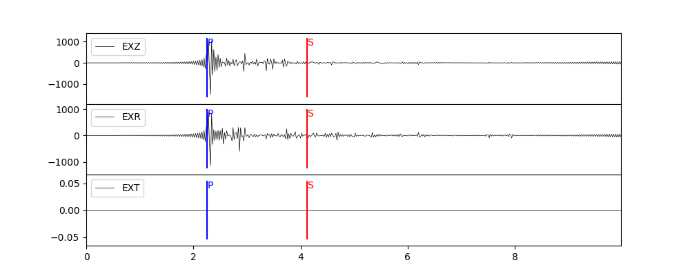
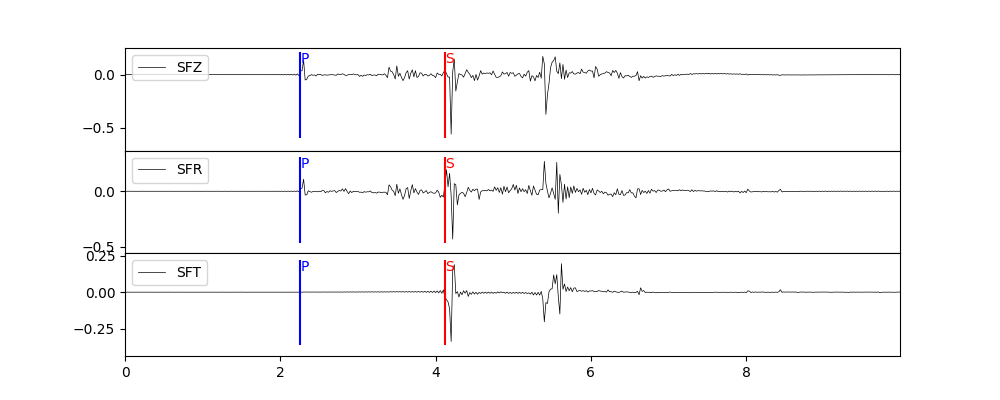
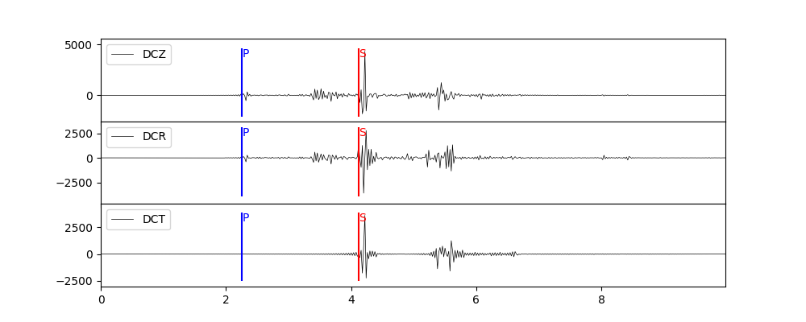
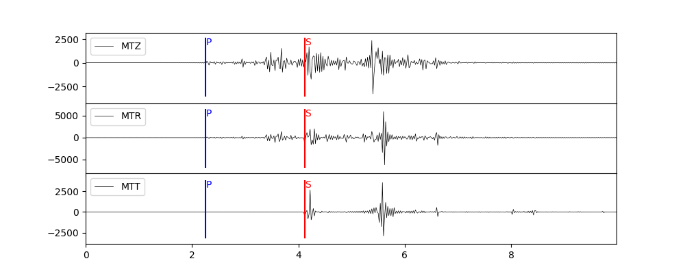
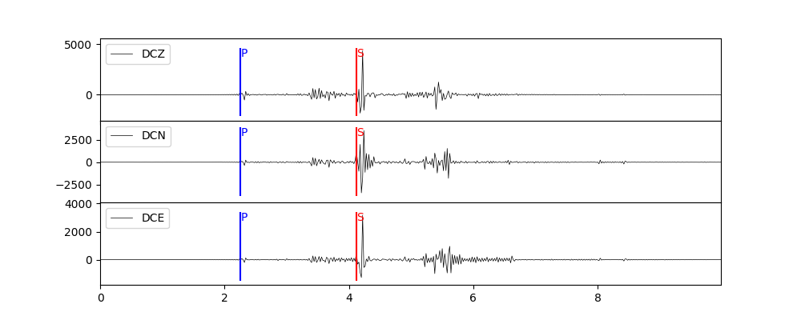
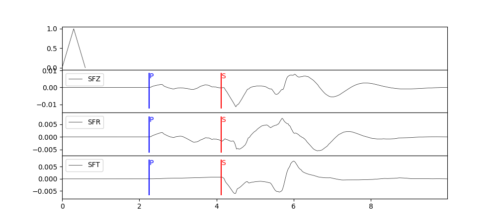
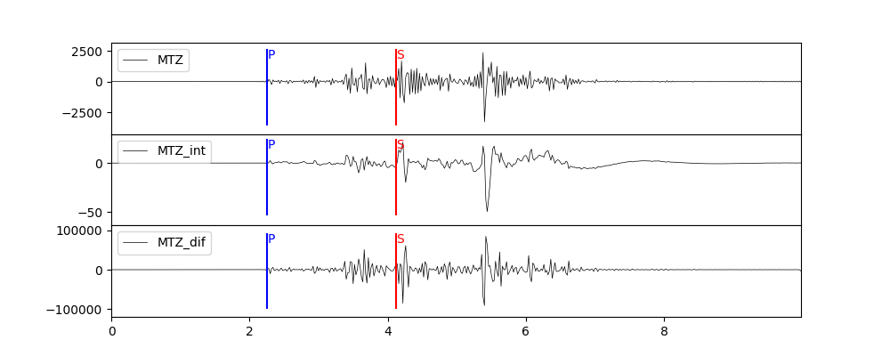
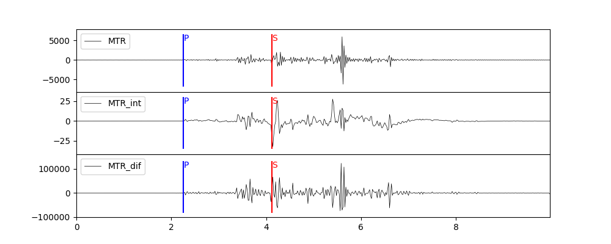
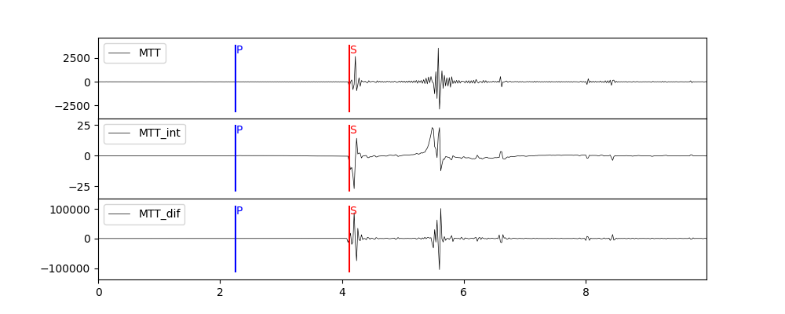

合成动态位移
=================

:Author: Zhu Dengda
:Email:  zhudengda@mail.iggcas.ac.cn

-----------------------------------------------------------

使用上节计算的格林函数，合成动态位移（理论地震图）。方便起见，这里统一使用milrow模型，震源深度2km，场点位于地表，震中距10km的格林函数，方位角30°。

不同震源
--------------

爆炸源
~~~~~~~~~~~~~~~~~
标量矩 1e24 dyne·cm。

.. tabs::  

    .. tab:: C 

        .. literalinclude:: run/run.sh
            :language: bash
            :start-after: BEGIN SYN EXP
            :end-before: END SYN EXP

    .. tab:: Python 

        .. literalinclude:: run/run.py
            :language: python
            :start-after: BEGIN SYN EXP
            :end-before: END SYN EXP

单力源
~~~~~~~~~~~~~~~~~
北向力 :math:`f_N=1`，东向力 :math:`f_E=-0.5`，垂直向下的力 :math:`f_Z=2`，单位 1e16 dyne。

.. tabs::  

    .. tab:: C 

        .. literalinclude:: run/run.sh
            :language: bash
            :start-after: BEGIN SYN SF
            :end-before: END SYN SF

    .. tab:: Python 

        .. literalinclude:: run/run.py
            :language: python
            :start-after: BEGIN SYN SF
            :end-before: END SYN SF

剪切源
~~~~~~~~~~~~~~
断层走向33°，倾角50°，滑动角120°，标量矩 1e24 dyne·cm。

.. tabs::  

    .. tab:: C 

        .. literalinclude:: run/run.sh
            :language: bash
            :start-after: BEGIN SYN DC
            :end-before: END SYN DC

    .. tab:: Python 

        .. literalinclude:: run/run.py
            :language: python
            :start-after: BEGIN SYN DC
            :end-before: END SYN DC

矩张量源
~~~~~~~~~~~~~~
:math:`M_{xx}=0.1, M_{xy}=-0.2, M_{xz}=1.0, M_{yy}=0.3, M_{yz}=-0.5, M_{zz}=-2.0`，单位 1e24 dyne·cm， **其中X为北向，Y为东向，Z为垂直向下**。

.. tabs::  

    .. tab:: C 

        .. literalinclude:: run/run.sh
            :language: bash
            :start-after: BEGIN SYN MT
            :end-before: END SYN MT

    .. tab:: Python 

        .. literalinclude:: run/run.py
            :language: python
            :start-after: BEGIN SYN MT
            :end-before: END SYN MT

分量旋转
---------------------
**PyGRT** 计算默认输出为ZRT分量（柱坐标系），可以设置参数以输出ZNE分量，这里以剪切源为例，

.. tabs::  

    .. tab:: C 

        .. literalinclude:: run/run.sh
            :language: bash
            :start-after: BEGIN ZNE
            :end-before: END ZNE

    .. tab:: Python 

        .. literalinclude:: run/run.py
            :language: python
            :start-after: BEGIN ZNE
            :end-before: END ZNE

卷积时间函数
---------------------
**PyGRT** 内置了一些震源时间函数，例如抛物波、梯形波、雷克子波或自定义，这里以单力源为例。

.. tabs::  

    .. tab:: C 

        .. literalinclude:: run/run.sh
            :language: bash
            :start-after: BEGIN TIME FUNC
            :end-before: END TIME FUNC

        生成的时间函数会以SAC格式保存在对应路径中，文件名为 :file:`sig.sac`。 其它时间函数以及具体参数用法可使用 :command:`grt.syn -h` 查看说明。

    .. tab:: Python 

        .. literalinclude:: run/run.py
            :language: python
            :start-after: BEGIN TIME FUNC
            :end-before: END TIME FUNC

        其它时间函数以及具体参数用法可在 :py:mod:`pygrt.signals` 模块中查看函数参数。

位移对时间积分、微分
--------------------------------
这里以矩张量源为例。

.. tabs::  

    .. tab:: C 

        .. literalinclude:: run/run.sh
            :language: bash
            :start-after: BEGIN INT DIF
            :end-before: END INT DIF

    .. tab:: Python 

        .. literalinclude:: run/run.py
            :language: python
            :start-after: BEGIN INT DIF
            :end-before: END INT DIF

