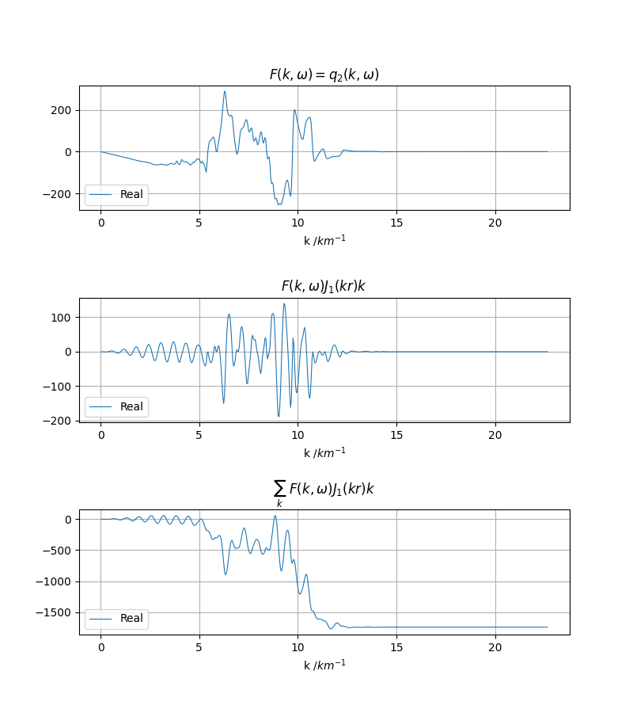
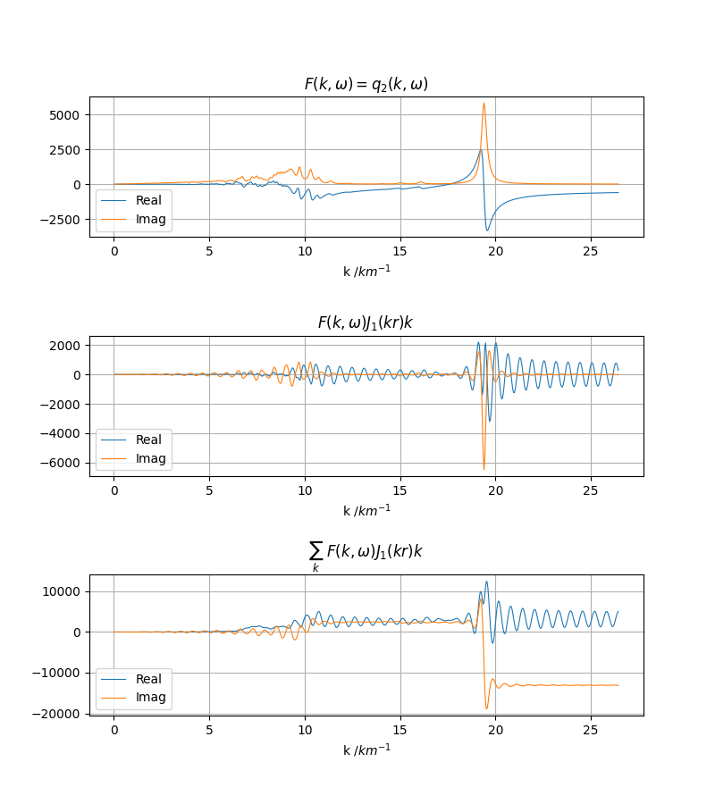
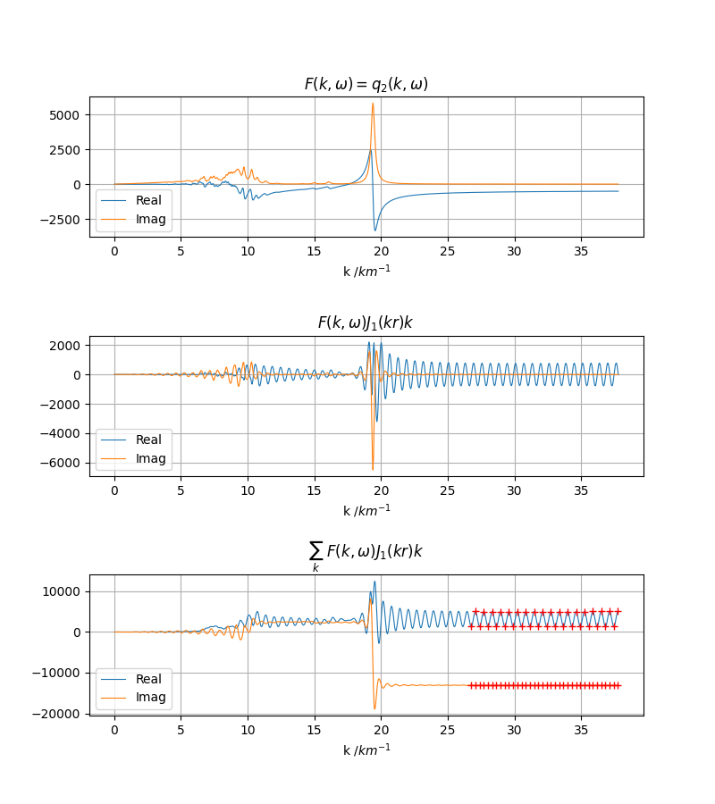
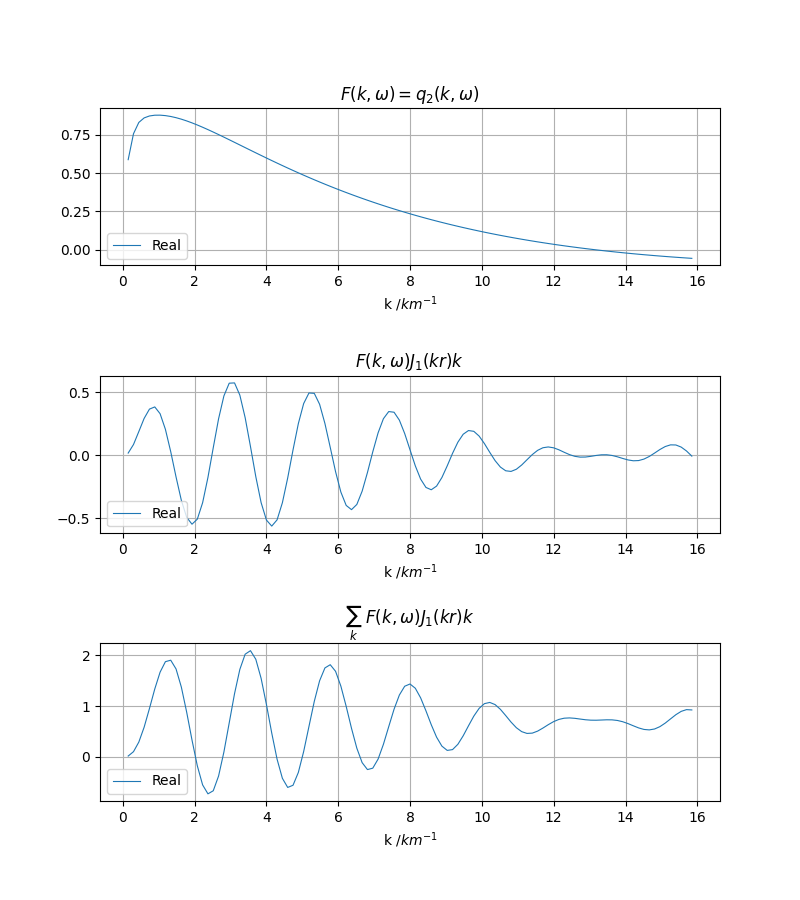
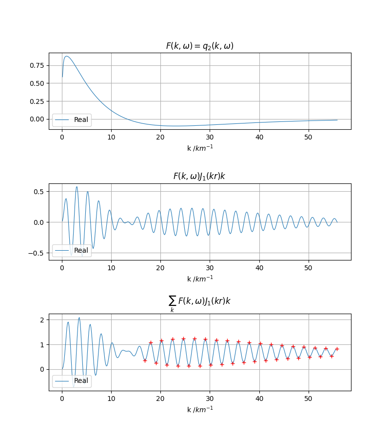

积分收敛性
===================

:Author: Zhu Dengda
:Email:  zhudengda@mail.iggcas.ac.cn

-----------------------------------------------------------

通过输出核函数文件，观察源点和场点深度接近时，积分收敛性的变化，以及峰谷平均法的作用。 **具体积分表达式以及分类详见** :ref:`gfunc_rst`。

核函数文件
---------------
该文件记录了波数积分过程中不同波数对应的核函数值。以下用法展示了如何输出该文件。

.. tabs::  

    .. tab:: C 

        .. literalinclude:: run/run.sh
            :language: bash
            :start-after: BEGIN DGRN
            :end-before: END DGRN

        输出的核函数文件路径会在  :rst:dir:`GRN_grtstats/milrow_{depsrc}_{deprcv}/` 路径下。

    .. tab:: Python

        .. literalinclude:: run/run.py
            :language: python
            :start-after: BEGIN DGRN
            :end-before: END DGRN

        输出的核函数文件路径会在自定义路径下。

C和Python导出的核函数文件是一致的，底层调用的是相同的函数。文件名称格式为 ``K_{iw}_{freq}``，其中 ``{iw}`` 表示频率索引值， ``{freq}`` 表示对应频率(Hz)。文件为自定义的二进制文件， **强烈建议使用Python进行读取及后续处理**。这里还是给出两种读取方法。

.. tabs::  

    .. tab:: C 

        :command:`grt.k2a` 程序可将单个核函数文件转为文本格式。

        .. literalinclude:: run/run.sh
            :language: bash
            :start-after: BEGIN grt.k2a
            :end-before: END grt.k2a

        输出的文件如下，

        .. literalinclude:: run/stats_head
            :language: text

        后续你可以选择习惯的方式读取和处理。

    .. tab:: Python

        .. literalinclude:: run/run.py
            :language: python
            :start-after: BEGIN read statsfile
            :end-before: END read statsfile

其中除了波数 ``k`` 外，每条结果的命名格式均为 ``{srcType}_{q/w/v}{m}``，与 :ref:`gfunc_rst` 部分介绍的积分公式中的核函数 :math:`q_m, w_m, v_m` 保持一致。

可视化
-------------
以下将使用Python进行图件绘制。 **在Python函数中指定震源类型、阶数、积分类型，可自动绘制核函数、被积函数和积分值随波数的变化**，其中积分类型对应 :ref:`gfunc_rst` 部分介绍的4种类型。

.. literalinclude:: run/run.py
    :language: python
    :start-after: BEGIN plot stats
    :end-before: END plot stats

可以通过指定 ``RorI=False`` 参数来指定绘制虚部，传入 ``RorI=2`` 表示实虚部都绘制。

.. literalinclude:: run/run.py
    :language: python
    :start-after: BEGIN plot stats RI
    :end-before: END plot stats RI

.. image:: run/DC_20_RI.png
    :align: center

从图中可以看到，当波数增加到一定范围以上，积分收敛良好，无振荡现象。

当震源和场点深度接近/相等时，积分收敛速度变慢
----------------------------------------------

假设其它参数不变，我们调整 **震源深度为0.1km**，再计算格林函数，读取核函数文件，绘制图像。

.. tabs::  

    .. tab:: C 

        .. literalinclude:: run/run.sh
            :language: bash
            :start-after: BEGIN DEPSRC 0.0 DGRN
            :end-before: END DEPSRC 0.0 DGRN

    .. tab:: Python

        .. literalinclude:: run/run.py
            :language: python
            :start-after: BEGIN DEPSRC 0.0 DGRN
            :end-before: END DEPSRC 0.0 DGRN

从图中可以清晰地看到，相比震源深度2km时，积分收敛速度明显变慢，积分值振荡，这要求增加波数积分上限，但这必然降低计算效率。

你可以尝试 **当震源和场点位于同一深度**，收敛振荡现象也很明显。要注意的是这和是否在地表无关，即使震源和场点都在地下，深度接近时积分收敛也会变慢。

峰谷平均法
-------------------------
具体原理很简洁易懂，从以下图像中你也能了解大概。详见 :ref:`(Zhang et al., 2003) <zhang_2003>` :ref:`(张海明, 2021) <zhang_book_2021>`。

在以上示例中，当震源和场点深度接近时，你会注意到输出的核函数文件增加了，这是因为程序内部设定 **当震源和场点深度差小于1km时，自动使用峰谷平均法（PTAM）**。具体流程为，程序中在进行完离散波数积分后，继续增加k（不同震中距使用不同dk），使用PTAM寻找足够数量的波峰和波谷（内部设定为36个），再对这些波峰波谷取缩减序列 :math:`M_i \leftarrow 0.5\times(M_i + M_{i+1})` ，得到估计的积分收敛值。取缩减序列的C代码如下，

.. code-block:: C 

    for(int n=n1; n>1; --n){
        for(int i=0; i<n-1; ++i){
            arr[i] = 0.5*(arr[i] + arr[i+1]);
        }
    }

在 ``K_{iw}_{freq}`` 文件同级目录下，程序把 **PTAM过程中的核函数以及积分峰谷位置分为两个文件** 保存在 ``PTAM_{ir}_{dist}/`` 目录下（ ``{ir}`` 为震中距索引， ``{dist}`` 为震中距），其中  ``PTAM_{ir}_{dist}/K_{iw}_{freq}`` 为核函数文件（格式不变）， ``PTAM_{ir}_{dist}/PTAM_{iw}_{freq}`` 为峰谷文件，其中记录积分值的峰谷。

.. note:: 

    :command:`grt.k2a` 程序也支持将 ``PTAM_{ir}_{dist}/PTAM_{iw}_{freq}`` 文件转为文本格式，

    .. literalinclude:: run/run.sh
        :language: bash
        :start-after: BEGIN grt.k2a ptam
        :end-before: END grt.k2a ptam

    输出的文件如下，

        .. literalinclude:: run/ptam_stats_head
            :language: text

    记录了不同震源、不同积分类型的峰谷位置。

故为了绘制完整的波数积分+PTAM过程，涉及三个文件。不过Python函数已经做了优化，由于程序输出的目录结构固定，文件命名格式固定，只需传入 ``PTAM_{ir}_{dist}/PTAM_{iw}_{freq}`` 文件，Python函数会自动读取对应的三个文件。

.. literalinclude:: run/run.py
    :language: python
    :start-after: BEGIN plot ptam
    :end-before: END plot ptam

红十字为选取的波峰波谷，再取缩减序列即可得到估计的积分收敛值。

静态解的积分收敛性
-------------------------
以上部分是以动态解为例，静态解从积分类型、收敛特征、文件格式、绘图完全类似，只是不再有频率索引值。

假设震源深度0.1km，场点位于地表，场点仅定义一个点(2,2)做示例，这里直接给出脚本。

.. tabs::  

    .. tab:: C 

        .. literalinclude:: run/run.sh
            :language: bash
            :start-after: BEGIN SGRN
            :end-before: END SGRN

    .. tab:: Python

        .. literalinclude:: run/run.py
            :language: python
            :start-after: BEGIN SGRN
            :end-before: END SGRN

+ 只使用离散波数积分

+ 使用峰谷平均法
  

