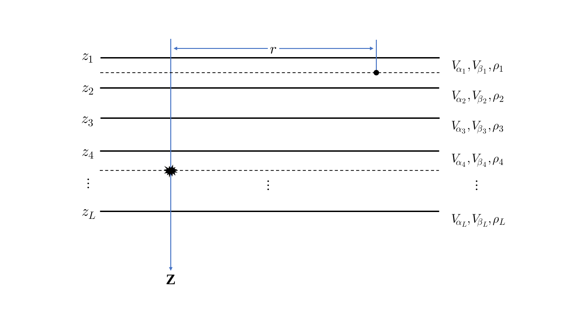

:author: 朱邓达
:date: 2025-04-17

准备工作
=============

**PyGRT** 程序包由 C 和 Python 两个编程语言的代码组成，目的是兼并高效性和便捷性。
底层复杂运算由 C 语言编写，并以可执行文件 :command:`grt` 的形式提供。
Python 接口主要负责组织模型与输出路径，并调用 :command:`grt` 完成计算与文件读写。

除了 Python 脚本式运行，也可直接在终端运行 :command:`grt` 。
受 |GMT| 的启发， :command:`grt` 程序对多个计算功能使用模块化管理，
可使用类似于以下格式来运行程序。每个模块可使用 ``-h`` 查看帮助。

.. code-block:: C

    grt <module-name> [<module-options>]

**C 程序的运行独立于 Python，不需要 Python 环境，从而满足了更多计算场景。**

建立模型文件
--------------------

   一维层状模型示意图， :math:`z_S` 为震源层， :math:`z_R` 为接收层

这里的选项卡 **C** 不代表内部是C语言代码，而是 **使用C程序** :command:`grt` 。后续的选项卡沿用此设定，不再解释。

.. tabs:: 

    .. tab:: C

        **PyGRT** 以如下自由格式定义模型中每层的物性参数，每列之间以空格隔开
        （最后两列的 Qp, Qs 可省略，即表示不考虑衰减）。
        当前程序仅动态全波解支持衰减，其他情况后续会逐步扩展。

        .. code-block:: text

            Thickness(km)    Vp(km/s)    Vs(km/s)   Rho(g/cm^3)   [Qp]   [Qs]

        
        例如 :file:`milrow` 模型（假设文本文件名为 `milrow` ）

        .. literalinclude:: dynamic/run/milrow
            :language: text
        

    .. tab:: Python

        模型格式与 C 一致，Python 端直接传入模型文件路径。

        .. literalinclude:: dynamic/run/run.py
            :language: python
            :start-after: START BUILD MODEL
            :end-before: END BUILD MODEL

.. note::

    最后一行表示半空间，对应厚度值不会被使用。

.. note::

    Vs 设置为 0 表示该层为液体层。