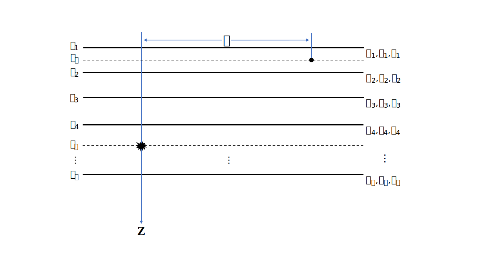

:author: 朱邓达
:date: 2025-04-17
:updated_date: 2025-09-22

准备工作
=============

**PyGRT** 程序包由C和Python两个编程语言的代码组成，目的是兼并高效性和便捷性。
底层复杂运算由C语言编写，编译链接成动态库 ``libgrt.so`` 供Python调用。Python通过 ``ctypes`` 库导入动态库以使用外部函数，以此兼并了C语言的高效和Python语言的便捷。

除了Python脚本式运行， **PyGRT** 保留传统命令行式运行C程序 :command:`grt` 。
受 `GMT <https://www.generic-mapping-tools.org/>`_ 的启发， :command:`grt` 程序对多个计算功能使用模块化管理，
可使用类似于以下格式来运行程序。每个模块可使用 ``-h`` 查看帮助。

.. code-block:: C

    grt <module-name> [<module-options>]

**C程序的运行独立于Python，不需要Python环境，从而满足了更多计算场景。** 

入门部分包含一些示例与说明，可快速上手。Github主页的 :rst:dir:`example/` 文件夹中有更多示例，可在 `Github Releases <https://github.com/Dengda98/PyGRT/releases>`_ 中下载。

建立模型文件
--------------------

这里的选项卡 **C** 不代表内部是C语言代码，而是 **使用C程序** :command:`grt` 。后续的选项卡沿用此设定，不再解释。

.. tabs:: 

    .. tab:: C

        **PyGRT** 以如下自由格式定义模型中每层的物性参数，每列之间以空格隔开（最后两列的 Qp, Qs 可省略）

        .. code-block:: text

            Thickness(km)    Vp(km/s)    Vs(km/s)   Rho(g/cm^3)   [Qp]   [Qs]

        
        例如 :file:`milrow` 模型（假设文本文件名为 `milrow` ）

        .. literalinclude:: dynamic/run/milrow
            :language: text
        

    .. tab:: Python

        模型格式与C一致，在Python中可以使用 :code:`np.loadtxt()` 导入文本文件，或者手动定义数组

        .. literalinclude:: dynamic/run/run.py
            :language: python
            :start-after: START BUILD MODEL
            :end-before: END BUILD MODEL

.. note::

    最后一行表示半空间，对应厚度值不会被使用。

.. note::

    Vs 设置为 0 表示该层为液体层。