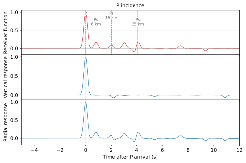
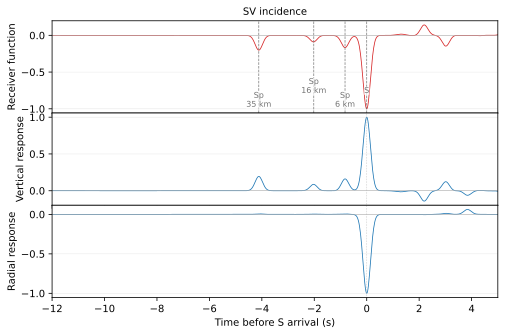

:author: 朱邓达
:date: 2026-09-09

计算接收函数
====================

基于相同的广义反射透射系数矩阵方法，
**PyGRT** 可计算层状模型中单位平面入射 P 或 SV 波在自由表面的接收函数。
C 模块见 :doc:`/Module/rftn`，Python 中对应 :meth:`PyModel1D.rftn() <pygrt.pymod.PyModel1D.rftn>`。
具体公式详见 :doc:`/Formula/others/rftn`。

以下示例使用如下模型文件：

.. literalinclude:: run/mod1
    :language: text

这里提供计算和绘图的脚本供下载参考：
:download:`Shell Scripts <run/run.sh>` | :download:`Python Scripts <run/run.py>`。

这里为了演示两种指定入射波参数的用法，假设

+ P 入射使用水平射线参数 *p* = 0.03 s/km
+ SV 入射使用底部半空间的 10° 入射角

.. tabs::

    .. group-tab:: CLI

        .. literalinclude:: run/run.sh
            :language: bash
            :start-after: BEGIN CLI RFTN
            :end-before: END CLI RFTN

        使用 **-W** 可以附加输出 Z/R 响应。

    .. group-tab:: Python

        .. literalinclude:: run/run.py
            :language: python
            :start-after: BEGIN PYTHON RFTN
            :end-before: END PYTHON RFTN

        设置 ``write_components=True`` 可以附加输出 Z/R 响应。

输出文件如下，

.. list-table::
    :header-rows: 1
    :widths: 20 30 45 40
    :align: center

    * - 入射波
      - 接收函数
      - 附加输出（如果有设置）
      - 时间参考零点
    * - P
      - *P_rftn.sac*
      - *P_Z.sac*、*P_R.sac*
      - P 波到时
    * - SV
      - *S_rftn.sac*
      - *S_Z.sac*、*S_R.sac*
      - S 波到时

以下结果图每个子图单独按最大绝对振幅归一化，仅用于比较波形形状；
每幅图包含三行，依次为接收函数以及 Z/R 响应。

    入射 P 波

    入射 SV 波
