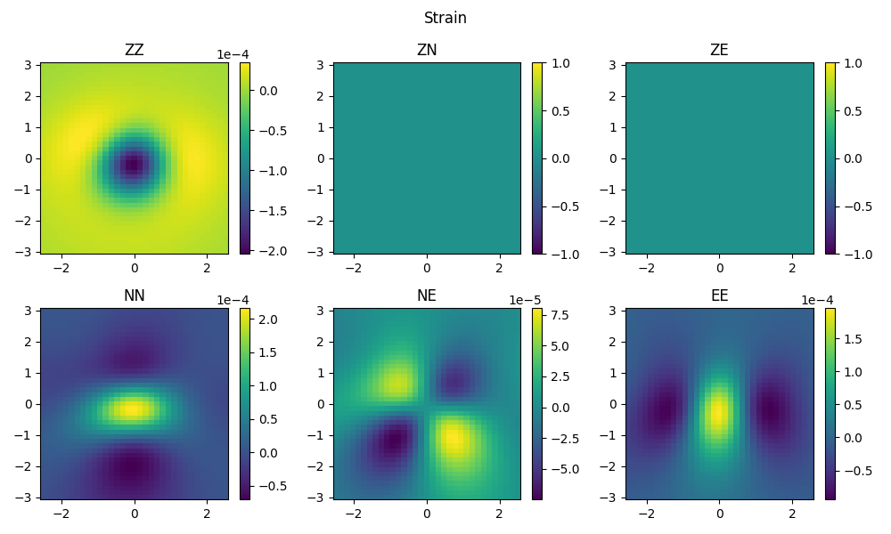
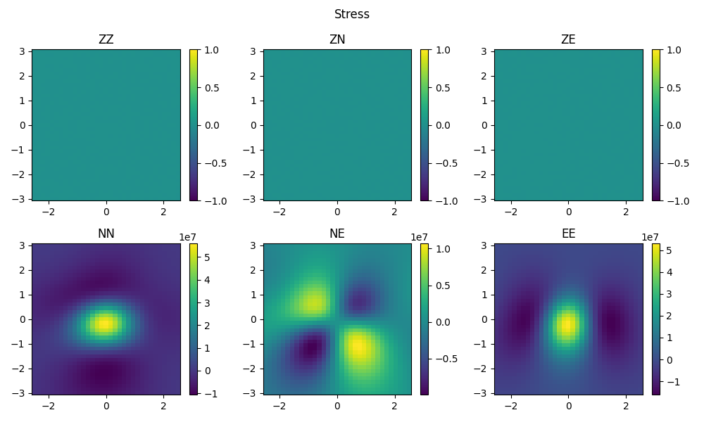

:author: 朱邓达
:date: 2025-04-17
:updated_date: 2025-09-19

计算静态应变、旋转、应力张量
=================================

除了使用不同的函数名/程序名，输出文件不同之外，流程基本和 :doc:`/Tutorial/dynamic/strain_stress` 类似。这里直接给出脚本。

.. tabs:: 

    .. group-tab:: C 

        计算结果会以新增变量的形式直接写入 nc 网格，可使用 ``ncdump -h`` 查看。
        
        .. literalinclude:: run_upar/run.sh
            :language: bash
            :start-after: BEGIN
            :end-before: END

    .. group-tab:: Python

        .. literalinclude:: run_upar/run.py
            :language: python

-------------

-------------

.. image:: run_upar/static_rotation.png
    :align: center 

-------------

由于场点位于地表（自由表面），过Z平面的应力均为0（由于浮点数计算误差，呈极小非零数），结果和理论保持一致。