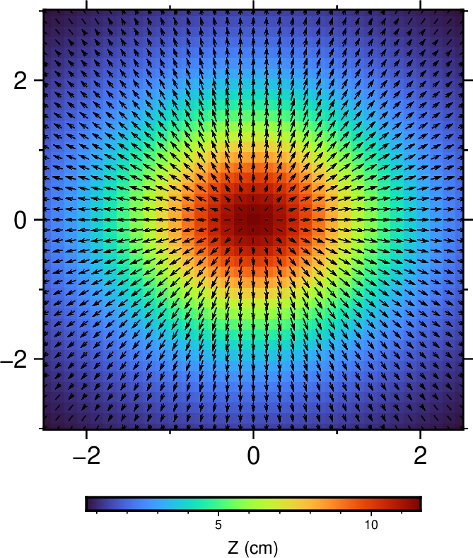
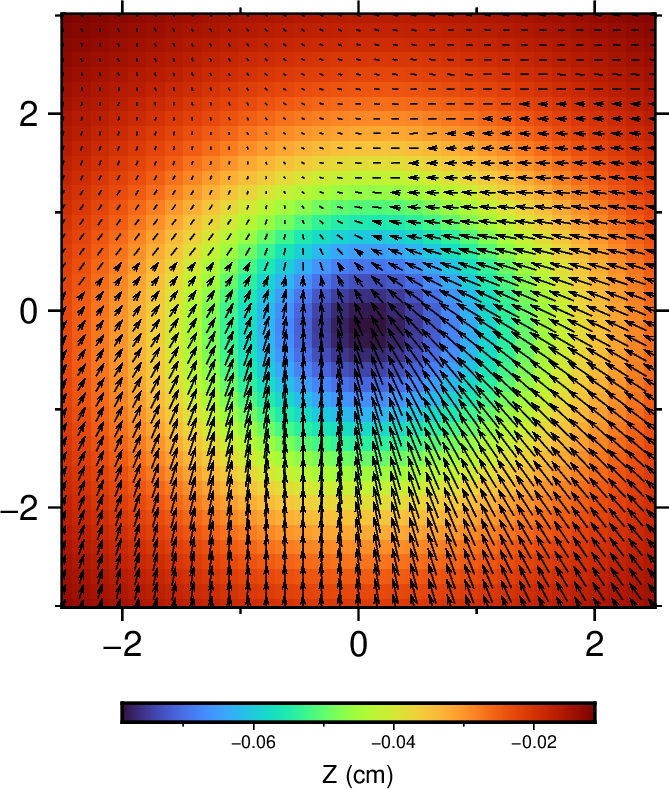
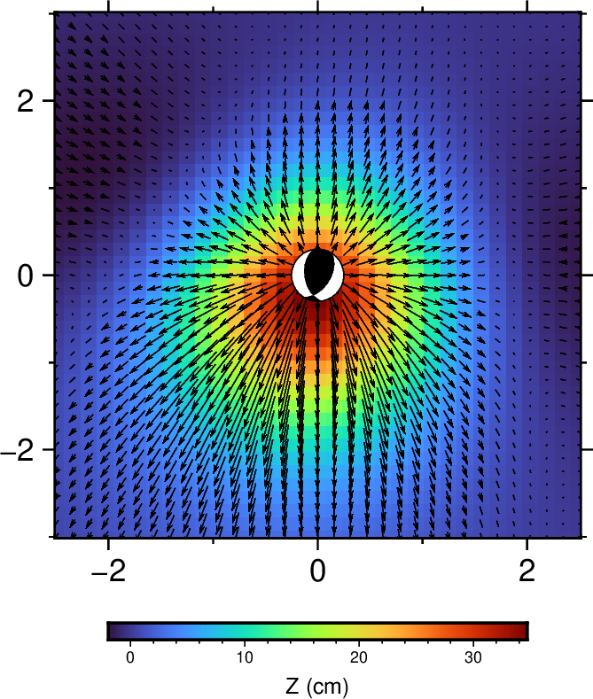
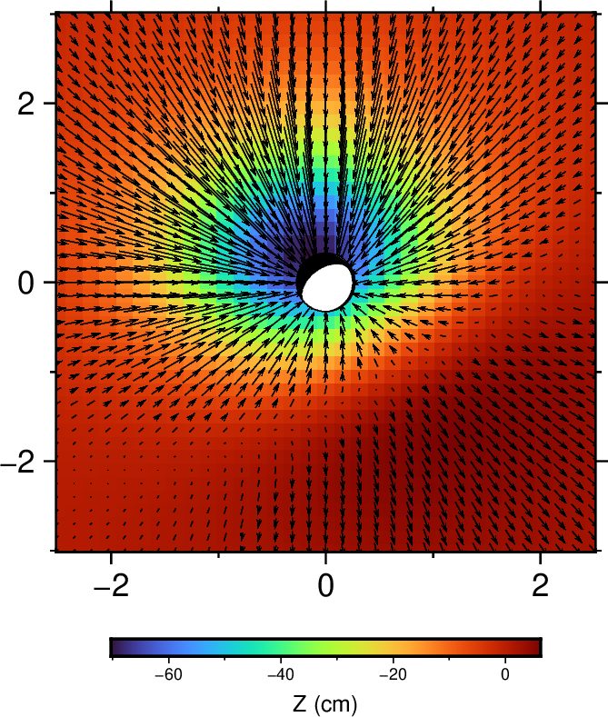

.. _static_syn_rst:

合成静态位移
=================

:Author: Zhu Dengda
:Email:  zhudengda@mail.iggcas.ac.cn

-----------------------------------------------------------

Python中合成静态位移的主函数为 :func:`gen_syn_from_gf_*() <pygrt.utils.gen_syn_from_gf_DC>` （\*表示对不同震源）（与合成动态位移的函数共用）  ，C程序为 :command:`stgrt.syn`。

使用上节计算的格林函数，合成静态位移。为方便画图，以下结果都使用ZNE分量。

不同震源
-------------
以下绘图使用Python绘制，绘图函数如下。这里也提供 `GMT <https://www.generic-mapping-tools.org/>`_ 绘图脚本（需根据实际数据调整参数，仅作参考）。

.. tabs:: 

    .. tab:: Python

        .. literalinclude:: run/run.py
            :language: python
            :start-after: BEGIN plot func
            :end-before: END plot func

    .. tab:: GMT 

        .. literalinclude:: run/run.sh
            :language: bash
            :start-after: BEGIN gmt
            :end-before: END gmt

爆炸源
~~~~~~~~~~~~~~~~~
标量矩 1e24 dyne·cm。

.. tabs::  

    .. group-tab:: C 

        .. literalinclude:: run/run.sh
            :language: bash
            :start-after: BEGIN SYN EXP
            :end-before: END SYN EXP

    .. group-tab:: Python 

        .. literalinclude:: run/run.py
            :language: python
            :start-after: BEGIN SYN EXP
            :end-before: END SYN EXP

单力源
~~~~~~~~~~~~~~~~~
北向力 :math:`f_N=1`，东向力 :math:`f_E=-0.5`，垂直向下的力 :math:`f_Z=2`，单位 1e16 dyne。

.. tabs::  

    .. group-tab:: C 

        .. literalinclude:: run/run.sh
            :language: bash
            :start-after: BEGIN SYN SF
            :end-before: END SYN SF

    .. group-tab:: Python 

        .. literalinclude:: run/run.py
            :language: python
            :start-after: BEGIN SYN SF
            :end-before: END SYN SF

剪切源
~~~~~~~~~~~~~~
断层走向33°，倾角50°，滑动角120°，标量矩 1e24 dyne·cm。

.. tabs::  

    .. group-tab:: C 

        .. literalinclude:: run/run.sh
            :language: bash
            :start-after: BEGIN SYN DC
            :end-before: END SYN DC

    .. group-tab:: Python 

        .. literalinclude:: run/run.py
            :language: python
            :start-after: BEGIN SYN DC
            :end-before: END SYN DC

这里如果改变倾角为90°，滑动角0°，就可以看到清晰的蝴蝶状辐射花样。

.. tabs::  

    .. group-tab:: C 

        .. literalinclude:: run/run.sh
            :language: bash
            :start-after: BEGIN SYN DC2
            :end-before: END SYN DC2

    .. group-tab:: Python 

        .. literalinclude:: run/run.py
            :language: python
            :start-after: BEGIN SYN DC2
            :end-before: END SYN DC2

.. image:: run/syn_dc2.png
    :width: 500px
    :align: center

矩张量源
~~~~~~~~~~~~~~
:math:`M_{xx}=0.1, M_{xy}=-0.2, M_{xz}=1.0, M_{yy}=0.3, M_{yz}=-0.5, M_{zz}=-2.0`，单位 1e24 dyne·cm， **其中X为北向，Y为东向，Z为垂直向下**。

.. tabs::  

    .. group-tab:: C 

        .. literalinclude:: run/run.sh
            :language: bash
            :start-after: BEGIN SYN MT
            :end-before: END SYN MT

    .. group-tab:: Python 

        .. literalinclude:: run/run.py
            :language: python
            :start-after: BEGIN SYN MT
            :end-before: END SYN MT

若指定 :math:`M_{xy}=-0.2`，其它均为零，则为纯剪切。

.. tabs::  

    .. group-tab:: C 

        .. literalinclude:: run/run.sh
            :language: bash
            :start-after: BEGIN SYN MT2
            :end-before: END SYN MT2

    .. group-tab:: Python 

        .. literalinclude:: run/run.py
            :language: python
            :start-after: BEGIN SYN MT2
            :end-before: END SYN MT2

.. image:: run/syn_mt2.png
    :width: 500px
    :align: center